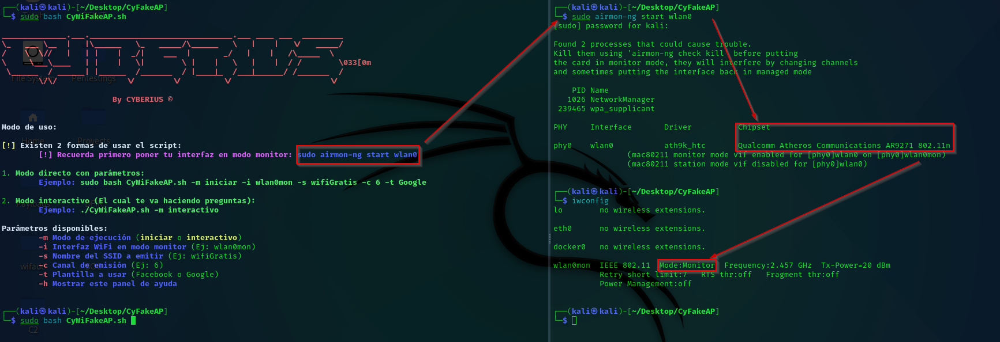
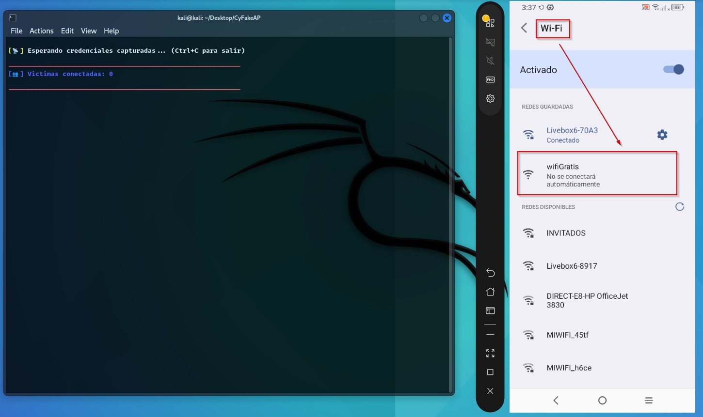

<p align="center">
  <a href="https://github.com/cyberiuscompany/CyFakeAP">
    
    <strong>Español</strong>
  </a>
  &nbsp;|&nbsp;
  
  <strong>English</strong>
  &nbsp;|&nbsp;
  <a href="https://www.youtube.com/watch?v=xvFZjo5PgG0&list=RDxvFZjo5PgG0&start_radio=1&pp=ygUTcmljayByb2xsaW5nIG5vIGFkc6AHAQ%3D%3D">
    
    <strong>日本語</strong>
  </a>
</p>

# CyFakeAP
Tool to deploy a Rogue Access Point (Fake Wi-Fi) with phishing templates for capturing Google and Facebook credentials.

<p align="center">
  
</p>

---

## 🎥 Demonstration

<p align="center">
  
</p>

---

## Tool Screenshots

### Important: *Before starting*, set your antenna to monitor mode
<p align="center">
  
</p>
<h2 align="center">List of 📡Antenna📡 Compatible with Monitor Mode in Kali Linux</h2>


| Model           | Chipset    | Frequency       | Speed  | Featured comment                                     | Buys     |
|------------------|------------|------------------|------------|-----------------------------------------------------------|------------|
| AWUS036ACH       | RTL8812AU  | 2.4 / 5.8 GHz     | 1200 Mbps  | Dual band, powerful, ideal for modern networks (ac)        | [🔗 Link](https://www.amazon.com/dp/B00VEEBOPG) |
| TL-WN722N (v1)   | AR9271     | 2.4 GHz           | 150 Mbps   | Highly compatible, economical and easy to set up           | [🔗 Link](https://www.google.com/search?q=tl-wn722n+(v1)) |
| AWUS036NH A      | AR9271     | 2.4 GHz           | 150 Mbps   | More powerful than TL-WN722N, same compatibility       | [🔗 Link](https://www.amazon.es/dp/B00358XUC4) |
| AWUS036NEH       | RT3070     | 2.4 GHz           | 150 Mbps   | Compact, reliable, good size/performance ratio    | [🔗 Link](https://www.amazon.es/dp/B0035OCVO6) |
| Signal King 3070 | RT3070     | 2.4 GHz           | 150 Mbps   | High power (2000 mW), ideal for long distances     | [🔗 Link](https://www.google.com/search?q=Signal+King+3070) |

<p align="justify">
If you can't find any of these models, try searching for them on stores like Amazon, AliExpress, eBay, Wallapop, PCComponentes, or MercadoLibre, making sure the chipset is compatible (AR9271, RTL8812AU, or RT3070); and if you have any questions, ask me directly on my <a href="https://disboard.org/server/1299310806617292922">Cyberius Community server 🔒</a>.
</p>

### Example of Fake Wi-Fi visible on Android and iPhone
<p align="center">
  
</p>

### Example of Captured Google Credentials
<p align="center"><em>This Google login panel opens automatically as soon as the victim clicks the "connect" button.</em></p>
<p align="center"><em>🚨 <strong>Tip:</strong> You can edit the login templates to your liking. </em></p>
<div align="center">
  
  
</div>

### Example of Captured Facebook Credentials
<p align="center"><em>This Facebook login panel opens automatically as soon as the victim clicks the "connect" button.</em></p>
<p align="center"><em>🚨 <strong>Tip:</strong> You can edit the login templates to your liking. </em></p>
<div align="center">
  
  
</div>

## 🌐 Why do devices automatically open the login page when connecting to `wifiGratis`?

When a victim connects to the fake access point `wifiGratis`, their device tries to check for real internet access by accessing specific URLs depending on the OS:

- **Android** → `http://clients3.google.com/generate_204`
- **iOS / macOS** → `http://captive.apple.com`
- **Windows** → `http://www.msftncsi.com`

Thanks to `dnsmasq`, all DNS traffic is redirected to `192.168.1.1`, which runs the fake login PHP server. So:

- No matter what URL the device tries to access, **it always sees our fake portal.**
- The OS thinks it's a **captive portal**, just like in airports or cafés.

🔄 Tool flow:

1. User connects to `wifiGratis`
2. Device detects a captive portal
3. Auto-opens login window
4. Fake Google or Facebook login is shown
5. If the victim falls, credentials are saved in `datos-privados.txt`

## 🚀 Main Features

- 🔐 **Credential capture** through phishing portals (Google & Facebook)
- 🧼 **Automatic cleanup and network restoration**
- 🗃️ **Credential storage** in `datos-privados.txt`
- 🧠 **Error detection** and user tips
- 🧩 **Interactive GUI mode (whiptail)** or command-line mode
- 📊 **Real-time victim monitoring**
- 📡 **Custom SSID broadcast**
- 📁 **Autogenerated logs and configs**
- 🌐 **Fake Access Point via `hostapd`**

## 🧰 Technologies Used

| Tool              | Function                                                  |
|-------------------|-----------------------------------------------------------|
| `bash`            | Main script and logic                                     |
| `hostapd`         | Fake Wi-Fi AP emission                                    |
| `dnsmasq`         | DHCP & DNS redirect to phishing portal                    |
| `php`             | Local server for hosting the phishing page                |
| `iptables/route`  | Network routing to local server                           |
| `whiptail`        | Lightweight GUI for interactive menus                     |
| `airmon-ng`       | Used to set interface into monitor mode                   |
| `ifconfig/iwconfig` | Network interface management                           |

## 📁 Project Structure

```bash
CyFakeAP/
├── Facebook/        # Facebook phishing template
├── Google/          # Google phishing template
├── images/          # Images used by templates
├── utilities/       # Additional scripts and helpers
├── CyWiFakeAP.sh    # Main Bash script
├── README.md        # Main documentation
├── DISCLAIMER.md    # Disclaimer file
├── banner.txt       # ASCII banner
└── LICENCE          # License file
```

## 📄 Additional Documentation

- [🤝 Code of Conduct](.github/CODE_OF_CONDUCT.md)
- [📬 Contributing Guide](.github/CONTRIBUTING.md)
- [🔐 Security Guidelines](.github/SECURITY.md)
- [⚠️ Legal Disclaimer](DISCLAIMER.md)
- [📜 License](LICENSE)
- [📢 Support](.github/SUPPORT.md)

## 📍 Best Locations to Deploy and Capture More Credentials

| 🏷️ Location                    | 🎯 Success Potential | 🔐 Likelihood of Capture | 💬 Justification                                                |
|-------------------------------|----------------------|---------------------------|------------------------------------------------------------------|
| 🚌 Bus Stations               | High                 | Very High                 | Bored users, likely to connect without thinking                  |
| ✈️ Airports                   | Very High            | High                      | Tourists quickly seeking free Wi-Fi                             |
| 🏫 Universities / Libraries   | High                 | High                      | Many devices, younger less cautious users                       |
| ☕ Cafés and Bars             | Medium               | High                      | Regular users checking emails or social media                   |
| 🏥 Hospitals / Health Centers | High                 | Medium                    | Distracted users waiting, idle browsing                         |
| 🏢 Coworking Spaces           | High                 | High                      | Many devices, often open networks                               |
| 🎓 Tech Events / Conferences  | High                 | Very High                 | Techies with multiple devices, often trusting public Wi-Fi      |
| 🛍️ Shopping Malls            | High                 | High                      | Common free Wi-Fi, users connect without verifying authenticity |
| 🚉 Train / Metro Stations     | High                 | High                      | Mass environments, phones reconnecting automatically            |
| 🏨 Hotels                    | Medium               | Medium                    | Users think it's the hotel network                              |

## ⚙️ Step 0: Set Interface to Monitor Mode 📡

```bash
# Check if "Mode: Managed"

──(kali㉿kali)-[~]
└─$ iwconfig
lo        no wireless extensions.

eth0      no wireless extensions.

docker0   no wireless extensions.

wlan0     IEEE 802.11  ESSID:off/any  
          🚨Mode:Managed🚨  Access Point: Not-Associated   Tx-Power=20 dBm   
          Retry short limit:7   RTS thr:off   Fragment thr:off
          Power Management:off
```

```bash
# Setting the antenna in "Mode:Monitor"

┌──(kali㉿kali)-[~]
└─$ sudo airmon-ng start wlan0

Found 2 processes that could cause trouble.
Kill them using 'airmon-ng check kill' before putting
the card in monitor mode, they will interfere by changing channels
and sometimes putting the interface back in managed mode

    PID Name
   1026 NetworkManager
 333413 wpa_supplicant

PHY     Interface       Driver          Chipset

phy1    wlan0           ath9k_htc       Qualcomm Atheros Communications AR9271 802.11n
                (mac80211 monitor mode vif enabled for [phy1]wlan0 on [phy1]wlan0mon)
                (mac80211 station mode vif disabled for [phy1]wlan0)

                                                                                                                                                                                                                                            
┌──(kali㉿kali)-[~]
└─$ iwconfig
lo        no wireless extensions.

eth0      no wireless extensions.

docker0   no wireless extensions.

wlan0mon  IEEE 802.11  🚨Mode:Monitor🚨  Frequency:2.457 GHz  Tx-Power=20 dBm   
          Retry short limit:7   RTS thr:off   Fragment thr:off
          Power Management:off
          
                                                                                                                                                                                                                                            
┌──(kali㉿kali)-[~]
└─$ 
```

## ⚙️ Step 1: Basic Installation on Kali Linux 🐧

```bash
git clone https://github.com/cyberiuscompany/CyFakeAP.git
cd CyFakeAP
sudo bash CyWiFakeAP.sh
```
