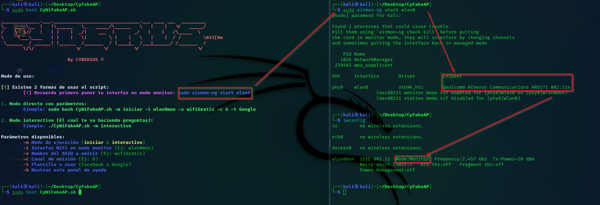
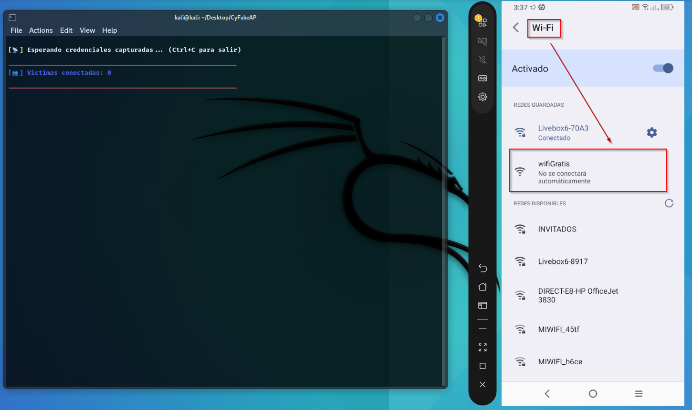
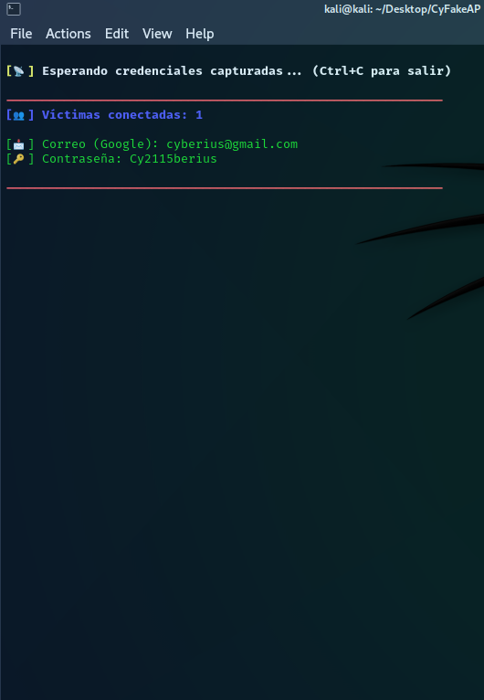
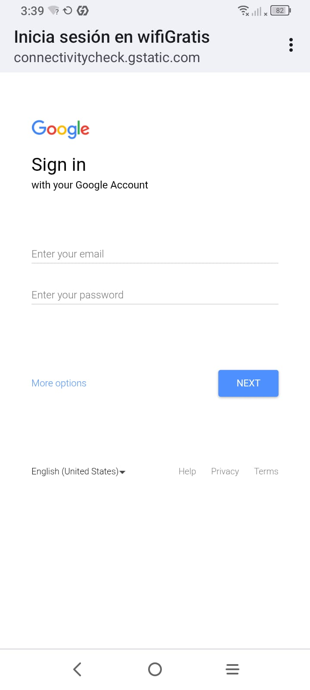
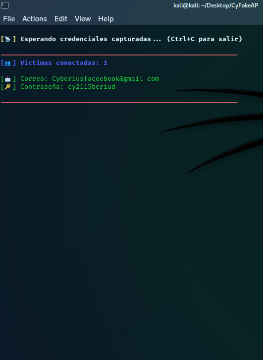
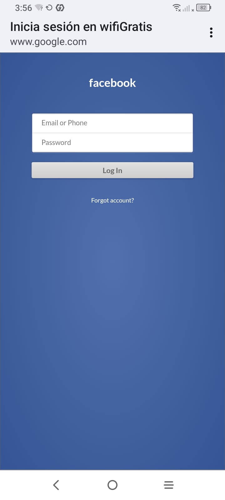

<p align="center">
  
  <strong>Español</strong>
  &nbsp;|&nbsp;
  <a href="README.en.md">
    
    <strong>English</strong>
  </a>
  &nbsp;|&nbsp;
  <a href="https://www.youtube.com/watch?v=xvFZjo5PgG0&list=RDxvFZjo5PgG0&start_radio=1&pp=ygUTcmljayByb2xsaW5nIG5vIGFkc6AHAQ%3D%3D">
    
    <strong>日本語</strong>
  </a>
</p>

# CyFakeAP
Herramienta para desplegar un *Rogue Access Point* o mas conocido, como una "Wi-Fi Falsa" con plantillas falsas para captura de credenciales de Google y Facebook

<p align="center">
  
</p

---

## 🎥 Demostración

<p align="center">
  
</p>

---

## Fotografías de la Herramienta

<h2 align="center">Importante *Antes de empezar* poner la 📡Antena📡 en modo monitor</h2>
<p align="center">
  
</p>

<h2 align="center">Ejemplo de red Wi-Fi Desplegada y visible desde un Móvil Android y iPhone</h2>
<p align="center">
  
</p>

<h2 align="center">Ejemplo de Credenciales Capturadas con Portal Falso de Google</h2>
<p align="center"><em>Este panel de login de Google se le abre al usuario de manera automatica y obligatario, nada mas pinchar el botón de  conectarse a la Wi-Fi.</em></p>
<p align="center"><em>🚨 **Recomiendación:** Recuerda que puedes editar las plantillas de Login a tu gusto. </em></p>
<div align="center">
  
  
</div>

<h2 align="center">Ejemplo de Credenciales Capturadas con Portal Falso de Facebook</h2>
<p align="center"><em>Este panel de login de Facebook se le abre al usuario de manera automatica y obligatario, nada mas pinchar el botón de  conectarse a la Wi-Fi.</em></p>
<p align="center"><em>🚨 **Recomiendación:** Recuerda que puedes editar las plantillas de Login a tu gusto. </em></p>
<div align="center">
  
  
</div>


## 🌐 ¿Qué hacen que los dispositivos al conectarse a la red `wifiGratis` les lleve al Login de manera automatica?

Cuando una víctima se conecta al punto de acceso falso `wifiGratis`, su dispositivo **intenta comprobar si hay acceso a Internet real**. Esto lo hace accediendo automáticamente a ciertas direcciones específicas, sin que el usuario lo sepa, dependiendo del sistema operativo, estas son las URLs típicas que se usan para esa comprobación:

- **Android** → `http://clients3.google.com/generate_204`
- **iOS / macOS** → `http://captive.apple.com`
- **Windows** → `http://www.msftncsi.com`

Gracias a la configuración de `dnsmasq`, todo el tráfico DNS está redirigido a `192.168.1.1`, que es donde corre el servidor PHP con la plantilla falsa. Es decir:

- No importa la URL que intente abrir el dispositivo, **siempre termina viendo nuestro portal falso (Google o Facebook).**
- El sistema operativo interpreta va hacia un **portal cautivo**, igual que cuando entras al WiFi de un aeropuerto o cafetería. 

🔄 Flujo de la herramienta: 

1. El usuario se conecta a `wifiGratis`.
2. El sistema (Android/iPhone) detecta que está detrás de un portal cautivo.
3. Abre una ventana automáticamente.
4. Se muestra el login falso preparado por CyFakeAP.
5. Si el usuario cae en la trampa, sus credenciales se registran en `datos-privados.txt`

## 🚀 Funcionalidades principales

- 🔐 **Captura de credenciales** a través de portales falsos (Google y Facebook)
- 🧼 **Limpieza automática del entorno** y restauración de la red al salir
- 🗃️ **Almacenamiento de credenciales capturadas** en `datos-privados.txt`
- 🧠 **Detección de errores comunes** y sugerencias al usuario
- 🧩 **Modo interactivo GUI (whiptail)** o modo por parámetros
- 📊 **Monitorización en tiempo real** de víctimas conectadas
- 📡 **Emisión de SSID personalizado** en el canal elegido
- 📁 **Logs y configuraciones temporales** autogenerados
- 🌐 **Creación de Rogue Access Point** con `hostapd`

## 🧰 Tecnologías utilizadas

| Herramienta       | Función                                                                 |
|-------------------|-------------------------------------------------------------------------|
| `bash`            | Script principal y lógica de control                                    |
| `hostapd`         | Emisión del punto de acceso WiFi falso                                  |
| `dnsmasq`         | Servidor DHCP y redirección DNS al portal falso                         |
| `php`             | Servidor local para alojar la plantilla de phishing                     |
| `iptables/route`  | Gestión de red para enrutar tráfico hacia el servidor local             |
| `whiptail`        | Interfaz gráfica ligera para el modo interactivo (menús, inputs)        |
| `airmon-ng`       | Herramienta externa usada para poner la interfaz en modo monitor        |
| `ifconfig/iwconfig` | Gestión directa de interfaces de red y modos de operación             |

## 📁 Estructura del proyecto

```bash
CyFakeAP/
├── Facebook/ # Plantilla phishing de Facebook
├── Google/ # Plantilla phishing de Google
├── images/ # Imágenes de las Plantillas
├── utilities/ # Scripts adicionales o utilidades de las Plantillas
├── CyWiFakeAP.sh # Script principal del proyecto
├── README.md # Documento principal (tú lo estás viendo)
├── DISCLAIMER.md # Documento de descargo de responsabilidad
├── banner.txt # Banner tipo ASCII del Script
└── LICENCE # Licencia de uso
```
---

## 📄 Documentación adicional

- [🤝 Código de Conducta](.github/CODE_OF_CONDUCT.md)
- [📬 Cómo contribuir](.github/CONTRIBUTING.md)
- [🔐 Seguridad](.github/SECURITY.md)
- [⚠️Aviso legal](DISCLAIMER.md)
- [📜 Licencia](LICENSE)
- [📢 Soporte](.github/SUPPORT.md)


## 📍 Mejores Lugares para Lanzar la Herramienta y Capturar Más Contraseñas

| 🏷️ Lugar                          | 🎯 Potencial de Éxito | 🔐 Probabilidad de Captura de Contraseñas | 💬 Justificación                                                         |
|----------------------------------|------------------------|-------------------------------------------|-------------------------------------------------------------------------|
| 🚌 Estaciones de autobuses       | Alta                   | Muy alta                                  | Muchos usuarios aburridos, sin datos móviles, conectan sin pensar.      |
| ✈️ Aeropuertos                    | Muy alta               | Alta                                       | Gente extranjera buscando WiFi gratis rápidamente.                      |
| 🏫 Universidades / Bibliotecas   | Alta                   | Alta                                       | Muchísimos dispositivos y usuarios jóvenes menos precavidos.            |
| ☕ Cafeterías y bares             | Media                  | Alta                                       | Red habitual de gente que revisa el correo o redes sociales.           |
| 🏥 Hospitales / Centros de salud | Alta                   | Media                                      | Usuarios distraídos, esperando, con tiempo libre.                      |
| 🏢 Oficinas compartidas (cowork) | Alta                   | Alta                                       | Muchos dispositivos, WiFi abierta o sin vigilancia.                    |
| 🎓 Congresos y eventos tech      | Alta                   | Muy alta                                   | Técnicos con múltiples dispositivos, pero muchos confían en redes WiFi. |
| 🛍️ Centros comerciales           | Alta                   | Alta                                       | WiFi gratuita común, usuarios conectan sin verificar autenticidad.     |
| 🚉 Estaciones de tren / metro    | Alta                   | Alta                                       | Ambientes masivos, móviles buscando conexión automática.               |
| 🏨 Hoteles                       | Media                  | Media                                      | Usuarios se conectan pensando que es la red del hotel.                  |

---
## ⚙️ 0 Poniendo en modo monitor la antena 📡

```bash
# Comprobando el "Mode" de la antena

──(kali㉿kali)-[~]
└─$ iwconfig
lo        no wireless extensions.

eth0      no wireless extensions.

docker0   no wireless extensions.

wlan0     IEEE 802.11  ESSID:off/any  
          🚨Mode:Managed🚨  Access Point: Not-Associated   Tx-Power=20 dBm   
          Retry short limit:7   RTS thr:off   Fragment thr:off
          Power Management:off
```

```bash
# Poniendo antena en "Mode:Monitor"

┌──(kali㉿kali)-[~]
└─$ sudo airmon-ng start wlan0

Found 2 processes that could cause trouble.
Kill them using 'airmon-ng check kill' before putting
the card in monitor mode, they will interfere by changing channels
and sometimes putting the interface back in managed mode

    PID Name
   1026 NetworkManager
 333413 wpa_supplicant

PHY     Interface       Driver          Chipset

phy1    wlan0           ath9k_htc       Qualcomm Atheros Communications AR9271 802.11n
                (mac80211 monitor mode vif enabled for [phy1]wlan0 on [phy1]wlan0mon)
                (mac80211 station mode vif disabled for [phy1]wlan0)

                                                                                                                                                                                                                                            
┌──(kali㉿kali)-[~]
└─$ iwconfig
lo        no wireless extensions.

eth0      no wireless extensions.

docker0   no wireless extensions.

wlan0mon  IEEE 802.11  🚨Mode:Monitor🚨  Frequency:2.457 GHz  Tx-Power=20 dBm   
          Retry short limit:7   RTS thr:off   Fragment thr:off
          Power Management:off
          
                                                                                                                                                                                                                                            
┌──(kali㉿kali)-[~]
└─$ 
```

## ⚙️ 1 Instalación básica con clonado en Kali Linux🐧

```bash
git clone https://github.com/cyberiuscompany/CyFakeAP.git
cd CyFakeAP
sudo bash CyWiFakeAP.sh
```

